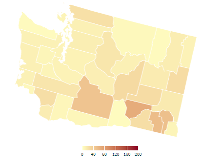
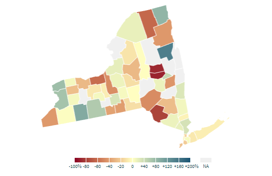

```{r setup, include=FALSE}
knitr::opts_chunk$set(echo = TRUE)
library(dplyr)
library(MazamaSpatialPlots)
library(readr)
```

## Objective

The goal of this document is to illustrate how **MazamaSpatialPlots** can be used
to easily recreate state or county level choropleth maps found on the web.

Throughout this document, we will be using data provided by 
[Opportunity Insights](https://opportunityinsights.org/); specifically, the data
used on their [Economic Tracker](https://www.tracktherecovery.org/) web app.

## Obtaining Data

All of the data we will use is easily obtainable from the Opportunity Insights 
[GitHub repository](https://github.com/OpportunityInsights/EconomicTracker). We
can use `read.csv()` to load data directly.

```{r loadData, warning = FALSE}
# COVID data by US county
URL1 <- "https://raw.githubusercontent.com/OpportunityInsights/EconomicTracker/main/data/COVID%20-%20County%20-%20Daily.csv.gz"
URL2 <- "https://raw.githubusercontent.com/OpportunityInsights/EconomicTracker/main/data/Zearn%20-%20County%20-%20Weekly.csv"
countyCovid <- readr::read_csv(URL1, col_types = cols())
countyMath <- readr::read_csv(URL2, col_types = cols())
```

```{r lookAtData}
head(countyCovid)
head(countyMath)
```

> We take a moment here to laud the people making this data available in a format
> that contains all the information we need and is easily ingestible using standard
> techniques. This kind of _open access data_ is precisely the kind of data management
> we hope for in all publicly funded research.

## Map 1: COVID Cases in Washington Counties

The first map we will recreate is the map of new cases in Washington state 
(by county). We define new cases to be a 7-day rolling average of confirmed
cases of COVID-19 per 100k residents.

This is the map displayed on Opportunity Insights' economic tracker:



We observe that the tilted map for Washington uses a projection that is appropriate
for the continental US and any states intersecting longitude -103.75 deg east.
In contrast, the **MazamaSpatialPlots** functions will chose the most appropriate
projection for each state or combination of states.

Using just the basic functionality of the `countyMap()` function,
we can make a map that is a reasonably closes match to the original map:

```{r map1_basic, warning = FALSE, error = FALSE}
mapDate <- lubridate::parse_date_time("2021 02 09", "y m d", tz = "UTC")

# column 'new_case_rate' is the confirmed covid cases per 100k residents, 7-day rolling average
countyCovid_formatted <- countyCovid %>%
  mutate(
    date = lubridate::parse_date_time(paste(year, month, day), "y m d", tz = "UTC"),
    countyFIPS = stringr::str_pad(countyfips, width = 5, pad = "0"),
    stateCode = US_stateFIPSToCode(substr(countyFIPS, 0, 2)),
    new_case_rate = as.numeric(new_case_rate)) %>%
  filter(date == mapDate) %>%
  group_by(countyFIPS) %>% 
  mutate(meanCaseRate = mean(new_case_rate, na.rm = TRUE)) %>%
  select(countyFIPS, stateCode, meanCaseRate)

countyMap(
  data = countyCovid_formatted,
  parameter = "meanCaseRate",
  stateCode = "WA",
  breaks = seq(0, 200, 40),
  palette = "YlOrBr",
  style = "cont", # continuous color scale
  legendOrientation = "horizontal",
  legendTitle = "",
  stateBorderColor = "white"
)
```

We have chosen the **RColorBrewer** palette that seems to be the best match for
the original palette. It's not perfect but it's close.

The other difference between the map created with `countyMap()` and the original 
is the position of the legend. We can add adjust this manually using functions 
provided by **tmap**.

```{r map1_fancy}
countyMap(
  data = countyCovid_formatted,
  parameter = "meanCaseRate",
  stateCode = "WA",
  breaks = seq(0, 200, 40),
  palette = "YlOrBr",
  style = "cont", 
  legendOrientation = "horizontal",
  legendTitle = "",
  stateBorderColor = "white"
) + tmap::tm_layout(
    legend.position = c("center", "bottom"),
    legend.outside = TRUE,
    legend.outside.position = "bottom",
    legend.outside.size = 0.1
)
```

What story does this map tell? We can see that the average number of new COVID-19 cases in Washington
State continue to be highest in the rural, farming counties of eastern Washington.

## Map 2: Student Math Participation in New York Counties

The next map we will recreate is the map of change in student participation
in Math in the state of New York (by county) aggregated at the end of the week. 
This is the map displayed on Opportunity Insights' economic tracker:



As before, we can use just the basic functionality **MazamaSpatialPlots**'s 
`countyMap()` function to make a map that comes close to matching the original map.
One aspect that `countyMap()` isn't able to replicate is the color palette used
by Opportunity Insights. It appears to be some darker variation of the Spectral
palette provided by **RColorBrewer** but we were unable to find an exact match.

```{r map2_basic, warning = FALSE, error = FALSE, message = FALSE}
mapDate <- lubridate::parse_date_time("2021 02 07", "y m d", tz = "UTC")

countyMath_formatted <- countyMath %>%
  mutate(
    date = lubridate::parse_date_time(paste(year, month, day_endofweek), "y m d", tz = "UTC"),
    countyFIPS = stringr::str_pad(countyfips, width = 5, pad = "0"),
    stateCode = US_stateFIPSToCode(substr(countyFIPS, 0, 2)),
    engagement = as.numeric(engagement) * 100.0) %>%
  dplyr::filter(date == mapDate)

countyMap(
  data = countyMath_formatted,
  parameter = "engagement",
  stateCode = "NY",
  breaks = c(seq(-100, 0, 20), seq(40, 200, 40)),
  palette = "Spectral",
  style = "cont",
  legendOrientation = "horizontal",
  legendTitle = "",
  stateBorderColor = "white"
)
```

Similarly to the previous example, we can adjust the position of the legend manually
by using **tmap**. We can also add the percent (%) symbol at the end of each label in the legend.
Finally, we will take the liberty of choosing a diverging color palette that better
conveys which counties show increased or decreased engagement.

```{r map2_fancy, warning = FALSE, message = FALSE}
breaks = c(seq(-100, 0, 20), seq(40, 200, 40))

countyMap(
  data = countyMath_formatted,
  parameter = "engagement",
  stateCode = "NY",
  breaks = breaks,
  palette = "RdBu",
  style = "cont",
  legendOrientation = "horizontal",
  legendTitle = "",
  stateBorderColor = "white"
) + tmap::tm_layout(
    legend.position = c("center", "bottom"),
    legend.outside = TRUE,
    legend.outside.position = "bottom",
    legend.format = list(fun = function(x) paste0(x, "%")),
    legend.outside.size = 0.1
)
```

Without additional information, no clear story emerges from this map. But it does
highlight several counties where additional information might reveal why they 
had a significant increase or decrease in student engagement.


